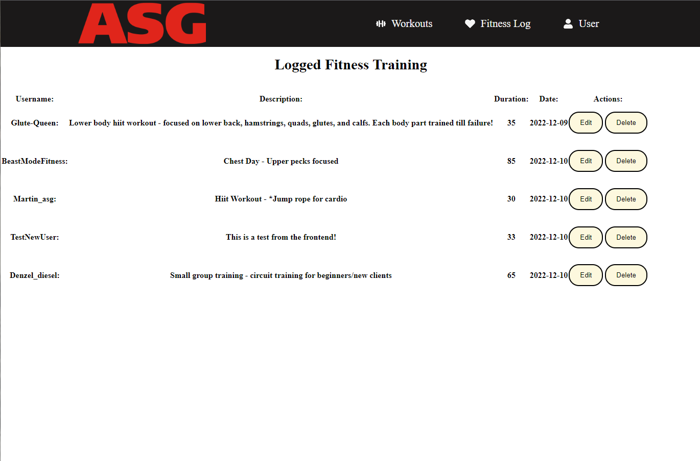

In the project directory, locate the "asg_backend" directory. Move the folder outside of the "asg_frontend" directory into the root folder. That way when we cd inside our frontend and cd inside our backend on two seperate terminals, we will run the backend on localhost:4000 and our frontend on localhost:3000:

### cd asg_frontend and `npm start` starts our frontend application
### cd asg_backend and `node index.js` starts our server and connection to database 

## Dependencies
npm install nodemon |
npm install node

